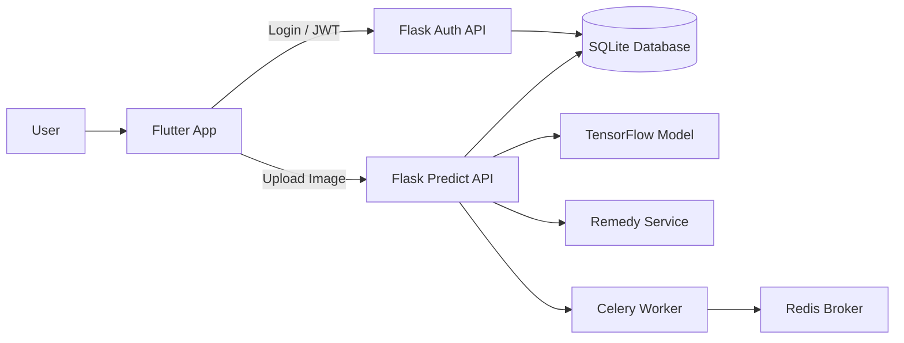
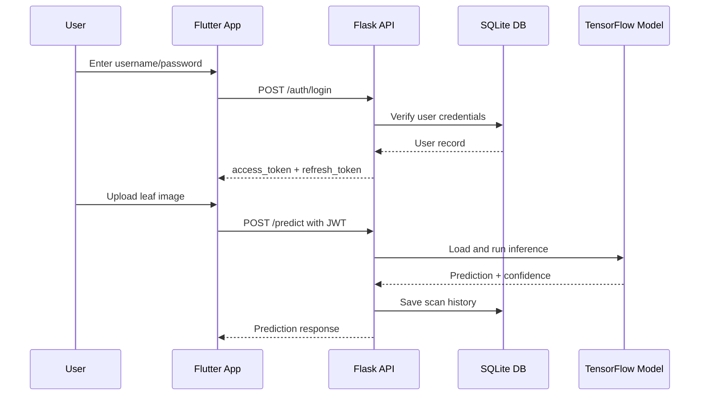
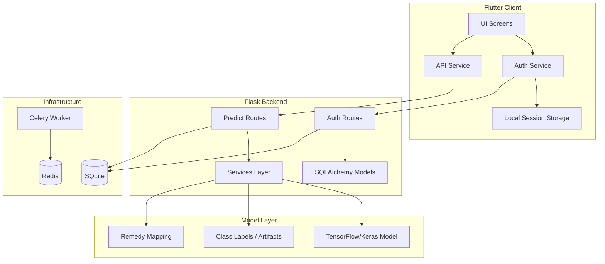
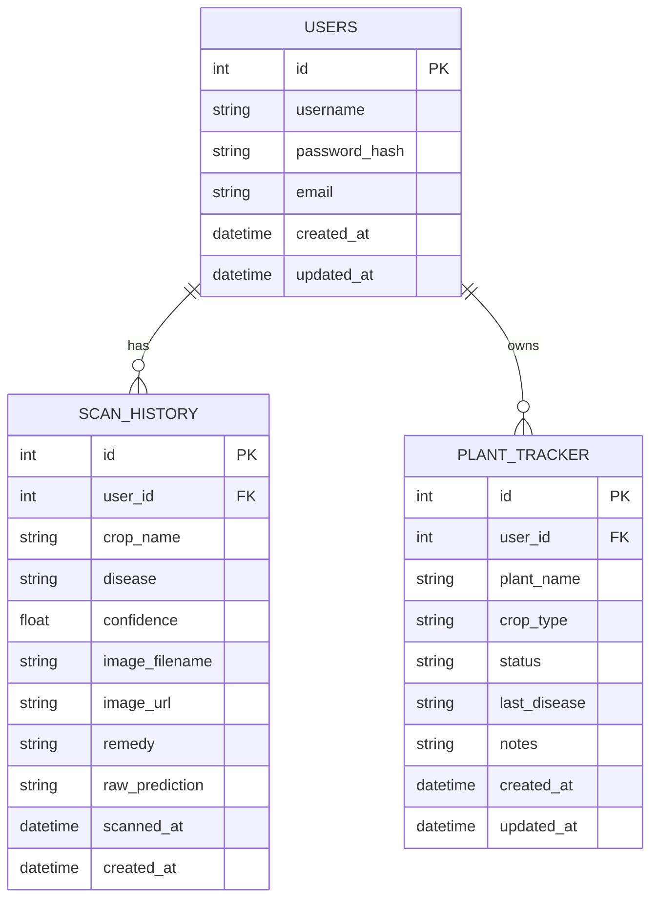
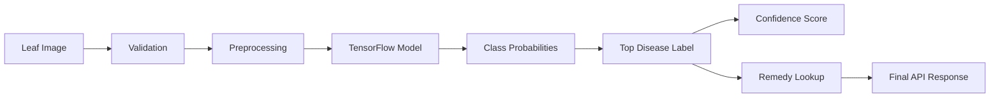

# Project Review Guide - Detailed Version

## 1. Project Goal

This project is a plant disease detection system that lets a user upload or capture a leaf image from a Flutter app, sends it to a Flask backend, runs a TensorFlow model for disease prediction, and returns a disease name, confidence score, and remedy guidance.

The system also includes JWT authentication, SQLite persistence, and a Celery + Redis background-processing setup.

## 2. High-Level Architecture

### What this diagram means
- The user interacts only with the Flutter client.
- The Flutter client talks to Flask APIs.
- The auth API issues JWT tokens.
- The prediction API loads the ML model and returns the result.
- Results can be stored in SQLite.
- Celery and Redis are available for asynchronous work.

## 3. Request Flow

## 4. Module-Wise Architecture

## 5. Current Features

### Authentication
- Login with username and password
- Registration endpoint
- Access token and refresh token support
- Protected endpoints using JWT
- Token storage in the Flutter client

### Prediction Flow
- Image upload from gallery or camera
- Request validation
- TensorFlow model inference
- Disease and confidence response
- Remedy guidance generation

### Persistence
- Store user data in SQLite
- Store scan history in the database structure
- Store plant tracking data in the database structure

### Client UI
- Landing page
- Sign in / create account screens
- Crop selection screen
- Scan screen
- Post-login dashboard navigation

## 6. Why These Technologies Were Chosen

### Flutter
Chosen because it gives one codebase for mobile and web.

Why not native Android/iOS?
- Two separate codebases would slow down development.
- Flutter keeps UI behavior consistent.

Why not React Native?
- Flutter provides more control over custom UI and rendering.
- It fit the project's UI-driven workflow better.

### Flask
Chosen because it is lightweight and easy to combine with Python ML code.

Why not Django?
- Django is more feature-heavy than needed here.
- This project mainly needs an API backend, not a full web framework stack.

Why not FastAPI?
- FastAPI is excellent, but Flask already matched the current codebase and development flow.
- The current backend is synchronous and simple enough for Flask.

### TensorFlow
Chosen because the disease model and training pipeline already use TensorFlow/Keras.

Why not PyTorch?
- Rewriting the existing ML pipeline would take extra time.
- TensorFlow already integrates with the saved model artifacts.

### SQLite
Chosen because it is fast to set up and works well for local development and demos.

Why not PostgreSQL now?
- PostgreSQL is better for production scaling.
- SQLite was enough to stabilize the app flow first.

### JWT
Chosen for stateless authentication and easy mobile/web integration.

Why not sessions only?
- JWT fits API-based clients better.
- Refresh tokens allow longer sessions without re-login every time.

### SQLAlchemy
Chosen to manage database objects in Python in a cleaner way.

Why not raw SQL?
- Raw SQL becomes harder to maintain as the project grows.
- ORM relationships are useful for users, scans, and plant tracking.

### Celery + Redis
Chosen to support asynchronous tasks.

Why not process everything inside the request?
- Long work would block the API.
- Celery keeps the app responsive.

## 7. Database Design

### Current tables
- `users`
- `scan_history`
- `plant_tracker`

### Entity relationship view

### Important note
The project is currently using SQLite directly, so schema migrations should be added later for safer updates.

## 8. Backend Module Breakdown

### `app/__init__.py`
- Creates the Flask app
- Loads configuration
- Initializes SQLAlchemy and JWT
- Registers routes
- Creates tables if missing
- Bootstraps the admin user

### `app/config.py`
- Stores app settings
- Defines database URI
- Defines JWT secret and expiry values
- Stores model path candidates and image constraints

### `app/routes/auth.py`
- Login endpoint
- Register endpoint
- Refresh endpoint
- Current-user endpoint

### `app/routes/predict.py`
- Health endpoint
- Crop list endpoint
- Image prediction endpoint
- JWT protection for secure routes

### `app/services/user_service.py`
- Verifies credentials
- Creates users
- Boots the default admin user

### `app/services/model_service.py`
- Loads the model
- Reads class name artifacts
- Runs inference
- Maps predictions to model labels

### `app/services/remedy_service.py`
- Maps predictions to remedies and treatment guidance

### `app/models/`
- Contains the SQLAlchemy models for users, scans, and plant tracking

## 9. ML / Model Pipeline

### What happens in prediction
- The image is validated for type and format.
- It is preprocessed to match the model input size.
- The TensorFlow model outputs probabilities.
- The top class becomes the disease prediction.
- Confidence is returned to the app.
- Remedy text is attached to the response.

## 10. What Problems Were Solved During Development

### 1. Broken login with schema mismatch
The app originally crashed because the database schema and code were not aligned.

Solution:
- Reworked the user flow
- Rebuilt the database schema
- Kept auth stable around usernames

### 2. Stale SQLite data
Old tables and columns caused runtime errors.

Solution:
- Reset the database
- Migrated the schema to match the current models

### 3. Flutter layout issues
Some UI elements were off-screen or hidden.

Solution:
- Made the landing screen scrollable
- Adjusted the auth flow for better usability

### 4. Token handling
The app needed proper session persistence.

Solution:
- Stored access and refresh tokens locally
- Added refresh token handling on the client

## 11. Known Gaps You Can Mention

- Proper migration tooling is still needed.
- PostgreSQL would be better for production.
- Production secrets should not be stored in the repo.
- Some features like history/diary are still foundations rather than fully polished user-facing workflows.
- Monitoring and centralized logging can still be improved.

## 12. Interview Questions With Strong Answers

### Q1. What is the core idea of this project?
**A:** It is a plant disease detection app that lets a user upload a leaf image, runs ML inference in the backend, and returns the disease result and remedy.

### Q2. Why is the architecture split into Flutter, Flask, and TensorFlow?
**A:** Flutter handles the UI, Flask acts as the API layer, and TensorFlow handles the ML inference. This separation keeps the system modular.

### Q3. Why was JWT used here?
**A:** Because the app is API-based and JWT supports stateless login with access and refresh tokens.

### Q4. Why did you not use a heavy backend framework?
**A:** The project did not need the full weight of a large monolithic framework. Flask was enough and faster to iterate with.

### Q5. Why is SQLite still acceptable in this version?
**A:** It was sufficient for development and review. It reduces setup complexity and keeps the project self-contained.

### Q6. What would you change for production?
**A:** I would move to PostgreSQL, add migrations, use stronger secret management, and improve monitoring and deployment hardening.

### Q7. How does token refresh work?
**A:** The client sends the refresh token to the refresh endpoint and receives a new access token without requiring the user to log in again.

### Q8. Why are there scan history and plant tracker tables if not all features are complete?
**A:** They provide a foundation for later features and make the database ready for expansion.

### Q9. How does the model get the disease label?
**A:** The backend loads the saved TensorFlow model, gets probabilities, and maps the top result to a class label using stored artifacts.

### Q10. Why did you choose SQLAlchemy?
**A:** It makes database code easier to manage and is more maintainable than writing all SQL manually.

### Q11. How do you secure the prediction route?
**A:** The route is protected with JWT so only authenticated users can access it.

### Q12. What is the role of Redis?
**A:** Redis is the broker and result backend for Celery tasks.

### Q13. What is the role of Celery?
**A:** It runs long or asynchronous tasks in the background so the API stays responsive.

### Q14. Why is the app good for a review demo?
**A:** It already demonstrates a full flow: login, authenticated navigation, image upload, backend inference, and response delivery.

### Q15. What is the biggest current limitation?
**A:** The current database approach is not yet backed by formal migrations, so schema management still needs improvement.

## 13. A Good Closing Statement for the Review

This project is a cross-platform plant disease detection system with a Flutter frontend, Flask backend, TensorFlow-based inference, JWT authentication, and SQLite persistence. The current version already shows a complete end-to-end flow and has a clear path to production hardening through migrations, PostgreSQL, and stronger deployment practices.
