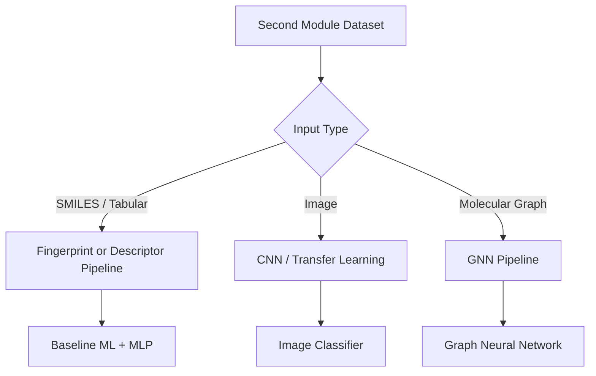

# Second Module Roadmap: Natural Drug Compound Classification

## Goal
Add a second feature/module to the existing project that handles **natural drug compound classification** while keeping the current plant disease detection system unchanged.

This second module should be built as a separate workflow inside the same project, reusing:
- Flutter UI shell
- Flask backend structure
- JWT authentication
- SQLite persistence layer
- Existing API and service patterns

---

## 1. First Decide the Exact Second Problem

Before coding, we need to define what the second module will do.

Possible outputs:
- compound class prediction
- bioactivity class prediction
- toxicity / non-toxicity classification
- plant/fungi/bacteria source classification
- drug-likeness classification

Possible input types:
- SMILES strings
- molecular descriptor tables
- CSV/tabular compound data
- molecular graphs
- structure images

This matters because the model type depends on the input data type.

---

## 2. Recommended Technical Direction

### If the data is tabular or SMILES-based
Use:
- baseline: Random Forest / XGBoost / SVM
- stronger version: MLP on fingerprints or descriptors
- advanced version: graph neural network later

### If the data is image-based
Use:
- CNN or transfer learning

### Best practical approach for this project
Start with a **tabular/SMILES classification pipeline** if the dataset is chemistry-based, because it is easier to train, explain, and integrate.

---

## 3. Roadmap Phases

## Phase 1: Problem Definition
Deliverables:
- finalize the exact second module task
- define input and output format
- define class labels
- define success metrics

Questions to answer:
- What are we predicting?
- What is the dataset format?
- How many classes are there?
- Is it binary or multiclass?

---

## Phase 2: Dataset Collection and Preparation
Deliverables:
- find a public or project-specific dataset
- clean missing values and duplicates
- standardize labels
- split into train/validation/test
- create a consistent preprocessing pipeline

If chemistry data is used, preprocessing may include:
- SMILES validation
- molecular fingerprint generation
- descriptor extraction
- scaling / normalization for numeric features

If graph data is used, preprocessing may include:
- atom features
- bond features
- graph conversion

---

## Phase 3: Baseline ML Model
Deliverables:
- one working baseline model
- saved model artifact
- label mapping file
- evaluation report

Suggested baseline options:
- Random Forest
- XGBoost
- Logistic Regression for simple binary classification
- MLP for fingerprints/descriptors

Why start with a baseline:
- faster to build
- easier to debug
- gives a reference score before adding advanced models

---

## Phase 4: Improved Model
Deliverables:
- improved model architecture
- better performance than baseline
- saved final artifact
- metrics comparison table

Possible upgrade paths:
- feature-engineered tabular model with XGBoost tuning
- MLP with dropout and batch normalization
- graph neural network if the dataset supports it

---

## Phase 5: Backend Integration
Deliverables:
- new Flask routes for the second module
- request validation
- prediction API
- result serialization
- optional history storage

Suggested API structure:
- `POST /compound/predict`
- `GET /compound/history`
- `GET /compound/classes`

Backend tasks:
- load second model
- preprocess incoming input
- run prediction
- return class + confidence
- optionally save to DB

---

## Phase 6: Database Design
Deliverables:
- add a new table for compound predictions
- store prediction history per user
- store timestamps and confidence scores

Suggested table fields:
- id
- user_id
- compound_input
- predicted_class
- confidence
- model_version
- created_at

---

## Phase 7: Flutter UI
Deliverables:
- new screen for the second module
- form or upload UI depending on data type
- result screen
- history view if required

Possible UI options:
- text input for SMILES
- file upload for CSV
- form fields for compound descriptors
- card-based result display

---

## Phase 8: Evaluation and Testing
Deliverables:
- accuracy / F1 / precision / recall
- confusion matrix if multiclass
- model comparison summary
- backend API tests
- UI flow verification

If the problem is imbalanced, also track:
- class weights
- ROC-AUC if binary
- PR-AUC if class imbalance is strong

---

## Phase 9: Final Polish
Deliverables:
- model versioning
- better error messages
- cleanup of edge cases
- documentation
- interview-ready explanation

---

## 4. Recommended Project Structure for the Second Module

```text
project/
|-- backend/
|   |-- app/
|   |   |-- routes/
|   |   |-- services/
|   |   |-- models/
|   |-- app.db
|-- mobile_app/
|-- model/
|   |-- compound/
|   |   |-- src/
|   |   |-- saved_model/
|   |   |-- artifacts/
|-- dataset/
|   |-- compounds/
```

---

## 5. Suggested Model Decision Tree



---

## 6. Suggested Execution Order

1. Finalize the second problem statement.
2. Confirm dataset format.
3. Build a baseline model.
4. Evaluate baseline results.
5. Improve the model if needed.
6. Add Flask API endpoint.
7. Add Flutter UI screen.
8. Store results in SQLite.
9. Test end-to-end.
10. Prepare interview explanation.

---

## 7. What to Tell in Review

If asked why this is a second module and not part of the first one:
- It is a separate ML problem with different input data and output labels.
- It reuses the same project infrastructure but has its own model pipeline.

If asked what model you will use:
- For chemistry/tabular data, I would start with fingerprint-based ML and move to an MLP or GNN if needed.
- For image data, I would use CNN or transfer learning.

If asked why not use the plant disease CNN directly:
- Because the data type may be completely different.
- A model should match the input representation, not just the app UI.

---

## 8. Current Status

- Module 1: plant disease detection is already complete.
- Module 2: roadmap drafted.
- Next step: confirm the exact dataset and input format for the natural drug compound task.

---

## 9. Short Summary

The second module should be built as a separate ML pipeline inside the same app. The first step is to define the compound task and dataset format. After that, build a baseline model, integrate it into Flask, add a Flutter screen, store results in SQLite, and then improve the model if needed.
